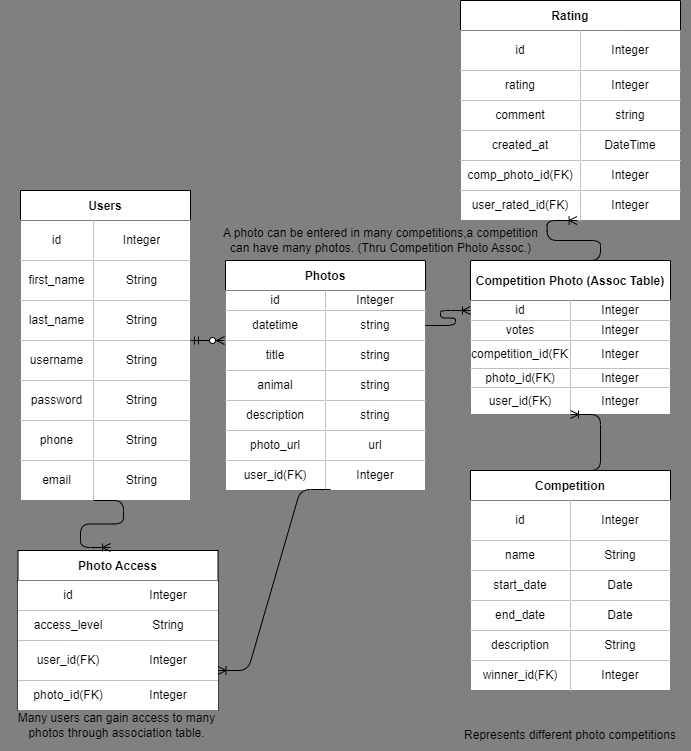

# Wildlife Pics

<!--Headings-->

## Startup Instructions

In root directory run: npm install --force  

In root directory run: pipenv install

In root directory run: pipenv shell

cd into server: cd server

while in server run: flask db upgrade

while in server run: sqlite3 app.db < seed/gen.sql

navigate to root directory: cd ..

while in root directory run: honcho start

## Description

Wildlife Pics is a web application that allows users to organize their wildlife photos, manage accessibility, and compete in public rating competition.

## User Stories

1. Anyone can go to the home site to see current public rating competition.
 
2. Anyone can sign up to become a user.
   
3. Previously signed up users can login to site.
   
4. Upon sign in user page will pop up.
   
5. Users can CRUD their photos.
    
7. Users can look up other users request access to other users photos.
    
8. Users can allow access to other users photos.
    
9. Users can enter competition weekly for best wildlife photo.

## Wireframe

### Home

### About

### User Page

### React Tree

### React Routes

### Database Schema

### API Routes

### Trello Board

## Stretch Goals

1. Add automatic email and/or text message notification of winning competition
2. Add direct photo storage with blob.
3. Add autonomous competition creation.